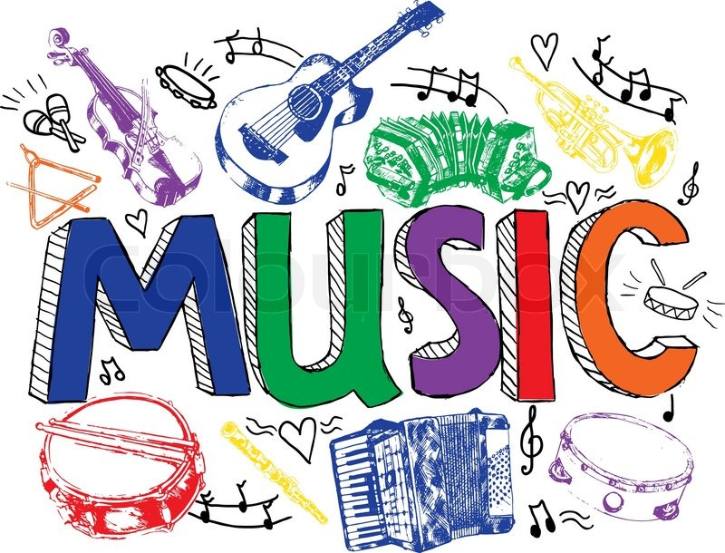
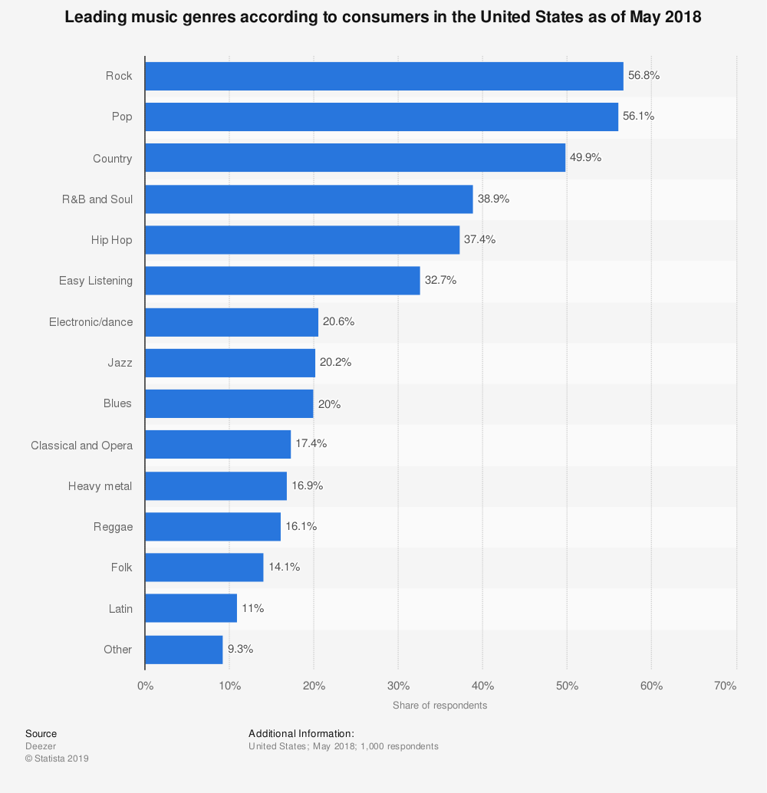

```{r package install, message=FALSE, warning=FALSE, echo=FALSE}
packages.used=c("rvest", "tibble", "qdap", "sentimentr", "gplots", "dplyr",
                "tm", "syuzhet", "factoextra", "beeswarm", "scales", "RColorBrewer",
                "RANN", "tm", "topicmodels", "plotly","wordcloud2", "wordcloud",
                "tidyr", "knitr")

# check packages that need to be installed.
packages.needed=setdiff(packages.used, intersect(installed.packages()[,1], 
                                                 packages.used))
# install additional packages
if(length(packages.needed)>0){
  install.packages(packages.needed, dependencies = TRUE)
}

# load packages
library("rvest")
library("tibble")
# You may need to run
# sudo ln -f -s $(/usr/libexec/java_home)/jre/lib/server/libjvm.dylib /usr/local/lib
# in order to load qdap
library("qdap")
library("sentimentr")
library("gplots")
library("dplyr")
library("tm")
library("syuzhet")
library("factoextra")
library("beeswarm")
library("scales")
library("RColorBrewer")
library("RANN")
library("tm")
library("topicmodels")
library("plotly")
library("wordcloud2")
library("wordcloud")
library("tidyr")
library("knitr")

#library(tidyverse)
#library(topicmodels)

# helper function
# source("../lib/plotstacked.R")
# source("../lib/speechFuncs.R")
```



In this project, I want to tell a data story about happy music songs. Music accompanys with us every day. It lifts us up when we are down, and sometimes move us to tear. I want to know more about happy music songs from the lyrics perspective.


```{r load data, echo=F}
## What comment out:- time consuming code------------------------------------------------------------------------
# load processed lyrics data: dt_lyrics
# load('../output/processed_lyrics.RData') 
```

# 1. What is the Happiest Genre?

Based on lyrics, to investigate the happiest genre, I started with sentiment analysis. I used the given stemmed lyrics since for sentiment analysis, the cleansed stop words do not carry much emtion and are irrelevant from the analysis. 

Then consider how to define a song is happy? Each song contains a mixture of different sentiments. In my opinion, when the joy sentiment takes the greatest portion in a song, I considered it  a happy song and used this definition afterwards. The sentiments of the stemmed keywords are according to the NRC Lexion in this project.

The following table gives some examples of the identified major emotion of a song added to the data frame for further analyses.


```{r Sentiment Analysis, echo=F}

lyrics.emotion.list <- NULL

## What comment out:-------------------------------------------------------------------------
## Time-consuming code commented out & result provided by load() follows:

# for(i in 1:nrow(dt_lyrics)){
#   stem.word.per.song <- dt_lyrics$stemmedwords[i]
#   if(length(dt_lyrics$stemmedwords)>0){
#     emotions=get_nrc_sentiment(stem.word.per.song)
#     word.count=word_count(stem.word.per.song)
#     # colnames(emotions)=paste0("emo.", colnames(emotions))
#     # in case the word counts are zeros?
#     emotions.fraction=emotions/(word.count+0.01)
#     lyrics.emotion.list=rbind(lyrics.emotion.list, 
#                               cbind(dt_lyrics[i,],
#                                     word.count,
#                                     emotions.fraction))
#   }
#   print(i)
# }
#
#save(lyrics.emotion.list, file="../output/lyrics.emotion.list.RData")

# result of step 1 of sentiment analysis
#load('../output/lyrics.emotion.list.RData') 

# find the major emotion for every song
#lyrics.emotion.list$dom.emotion <- NULL
#df.temp <- lyrics.emotion.list %>% select(anger:trust)
#lyrics.emotion.list$dom.emotion <- colnames(df.temp)[max.col(df.temp,ties.method="first")]
# save(lyrics.emotion.list, file="../output/lyrics.emotion.list.dom.RData")
# --------------------------------------------------------------------------------------------

# result of sentiment analysis: major emotion identified
# named: lyrics.emotion.list
load('../output/lyrics.emotion.list.dom.RData') 
```

```{r, echo=F}
kable(head(lyrics.emotion.list,5) %>% select(song, genre, major.emotion=dom.emotion))
```

```{r Sentiment Plots, echo=F}
pct.emo.distr <- lyrics.emotion.list %>% 
  group_by(genre, dom.emotion) %>%
  summarise(subtotal.genre.emo=n()) %>%
  mutate(pct_emo=subtotal.genre.emo/sum(subtotal.genre.emo))
pct.emo.distr$genre <- factor(pct.emo.distr$genre, 
                              levels = c("Country", "Electronic", "Folk", "Hip-Hop", "Indie", "Jazz", "Metal", "Pop", "R&B", "Rock", "Other", "Not Available"))

genre.emotion.plot <- ggplot(data = pct.emo.distr, 
                             aes(x = dom.emotion, y=pct_emo, fill=genre))+
              geom_bar(stat="identity", position=position_dodge()) +
  labs(title = "Percentage of Songs",
       subtitle = "expresses different emotions from different genres",
       x = "dominated emotion", 
       y= "percentage of songs")+
  theme_light()+theme(plot.title = element_text(hjust = 0.5),
                      plot.subtitle = element_text(hjust = 0.5))

ggplotly(genre.emotion.plot)  
```

After sentiment analysis was completed, I made a bar plot, as above, to see how the songs of different genres distributed among the eight categories of emotions. From the plot, I noticed that joy is the most popular emotion in nearly all genres, except for Hip-Hop and Metal. (Hip-Hop mainly focuses on anger and Metal focuses on fear.) And noticeably, Jazz is the happiest genre based on the given corpus of songs. 43.3% of Jazz songs express majorly joy emotion.

Then I want to investigate more and compare the top 2 happiest genre: Jazz and R&B, according to the plot above. 

# 2. Focused on the top 2 happiest genres and their "joy" songs: 
### - Are they similar or different? 

### 2.1 Overview of the most frequent word   
To get an overall understanding of the "joy" emotion songs of Jazz and R&B genre, I first take a look at the most frequently used words through wordclouds.

```{r Wordclouds, echo=F}

## What comment out:-------------------------------------------------------------------------
## Time-consuming code commented out & result provided by load() follows:

## tokenized stemmed lyrics:
#tokenized.stem.lyrics <- lyrics.emotion.list %>% unnest_tokens(word, stemmedwords)
#save(tokenized.stem.lyrics, file="../output/tokenized.stem.lyrics.RData")
#load("../output/tokenized.stem.lyrics.RData")

#tokenized.word <- tokenized.stem.lyrics %>% select(song, year, artist, genre, id, word.count, dom.emotion, word) 
#tokenized.word.joy <- tokenized.word %>% filter(dom.emotion=="joy")  %>% filter(genre %in% c("Jazz", "R&B"))
#save(tokenized.word.joy, file="../output/tokenized.word.joy.RData")
# --------------------------------------------------------------------------------------------

# data named: tokenized.word.joy
load("../output/tokenized.word.joy.RData")

## short-list of the most frequently used stemmed word from joy songs of Jazz and R&B:
short500.tokenized.joy <- tokenized.word.joy %>% filter(genre %in% c("Jazz", "R&B")) %>% 
   count(word, sort = TRUE) %>% 
  head(500)
```

**For "joy" Jazz and R&B genres:**  
```{r, echo=F}
## For Jazz and R&B:
#wordcloud2(short500.tokenized.joy, color = "firebrick", size=1)
wordcloud(short500.tokenized.joy$word, short500.tokenized.joy$n,
          max.words=500,
          min.freq=1,
          random.order=FALSE,
          rot.per=0.3,
          use.r.layout=T,
          random.color=FALSE,
          colors="firebrick")
```

**For Jazz:**  
```{r, echo=F}
## For Jazz:
Jazz.joy.word <- tokenized.word.joy %>% filter(genre == "Jazz")
short500.Jazz <- Jazz.joy.word %>% count(word, sort = TRUE) %>% head(500)
#wordcloud2(short500.Jazz, color = "gold", size=0.3, b="blck")
wordcloud(short500.Jazz$word, short500.Jazz$n,
          max.words=500,
          min.freq=1,
          random.order=FALSE,
          rot.per=0.3,
          use.r.layout=T,
          random.color=FALSE,
          colors="gold")
```

**For R&B:**  
```{r, echo=F}
## For R&B:
RnB.joy.word <- tokenized.word.joy %>% filter(genre == "R&B")
short500.RnB <- RnB.joy.word %>% count(word, sort = TRUE) %>% head(500)
#wordcloud2(short500.RnB, color = "darkorchid", size=0.3, b="blck")
wordcloud(short500.RnB$word, short500.RnB$n,
          max.words=500,
          min.freq=1,
          random.order=FALSE,
          rot.per=0.3,
          use.r.layout=T,
          random.color=FALSE,
          colors="darkorchid")
```

From the wordcloud plots, I found that Jazz and R&B used similar key stemmed words to express joy. No matter I look from a single genre alone or two genres combined, love, baby, heart, etc all appear to be among the most frequent words in all the wordcloud plots above. This finding motivates me think about how similar their song topics are under the joy category. Are these joy songs not only have same emotions, but also use similar topics? Are people singing about the same joyful topic for different genres?

With this question in mind, I then continued doing topic modelling to solve my questions.

### 2.2 Topic modelling

Before doing topic modelling, I converted the stemmed word data from data frame back to Corpus to generate the [document-term matrix](https://en.wikipedia.org/wiki/Document-term_matrix). Then I adopted the [LDA(Latent Dirichlet Allocation)](https://en.wikipedia.org/wiki/Latent_Dirichlet_allocation) method to allocate topics describing these joy Jazz and R&B songs. The number of topics selected is by trial and error such that meaningful topics can be inferred from the grouped keywords. Finally, I selected the topic number as seven.

After running LDA, based on the result, I manually hashtagged topics according to their corresponding most popular and  most salient terms. For example, for the Topic 3, which is of interest later, I labelled it as "Love" since "woman", "babe", "dear", "thrill" etc. are the keywords for this topic.

```{r, echo=F, warning = F}
## Convert back from data frame back to Corpus to do LDA
lyrics.emotion.jazz.rb <- lyrics.emotion.list %>% 
  filter(genre %in% c("Jazz", "R&B")) %>% 
  filter(dom.emotion=="joy")
  
stemmedwords.jazz.rb <- lyrics.emotion.jazz.rb %>% select(stemmedwords) #2539*1 df
stemmedwords.jazz <- lyrics.emotion.jazz.rb %>% filter(genre=="Jazz") %>% select(stemmedwords)
stemmedwords.rb <- lyrics.emotion.jazz.rb %>% filter(genre=="R&B") %>% select(stemmedwords)

jazz.rb.source <- VectorSource(stemmedwords.jazz.rb$stemmedwords)
jazz.rb_corpus <- VCorpus(jazz.rb.source)
frequent_terms <- freq_terms(stemmedwords.jazz.rb$stemmedwords, 30)
frequent_terms <- freq_terms(stemmedwords.jazz$stemmedwords, 30)
frequent_terms <- freq_terms(stemmedwords.rb$stemmedwords, 30)

## Generate document-term matrices(DTM)
dtm <- DocumentTermMatrix(jazz.rb_corpus)
rowTotals <- apply(dtm , 1, sum)# find the sum of words in each Document

## run LDA for all joy Jazz and R&B music
burnin <- 4000
iter <- 2000
thin <- 500
seed <-list(2003,5,63,100001,765)
nstart <- 5
best <- TRUE

# number of topics
k <- 7

## What comment out:----------------------------------------------------------------------------------------
## Time-consuming code commented out & result provided by load() following:
# run LDA using Gibbs sampling
#ldaOut <-LDA(dtm, k, method="Gibbs", control=list(nstart=nstart,  seed = seed, best=best,burnin = burnin, iter = iter, thin=thin))
#save(ldaOut, file="../output/ldaOut.RData")
#-----------------------------------------------------------------------------------------------------------
# the result of LDA topic modelling
load("../output/ldaOut.RData")

ldaOut.topics <- as.matrix(topics(ldaOut))

# top 20 terms in each topic
ldaOut.terms <- as.matrix(terms(ldaOut,20))

# probabilities associated with each topic assignment
topicProbabilities <- as.data.frame(ldaOut@gamma)

terms.beta=ldaOut@beta
terms.beta=scale(terms.beta)
topics.terms=NULL
for(i in 1:k){
  topics.terms=rbind(topics.terms, ldaOut@terms[order(terms.beta[i,], decreasing = TRUE)[1:7]])
}

# Based on the most frequent stemmed word and also referenced to the Topic Probability from the LDA process, I manully assigned a hashtag to the generated Topic as following.
topics.hash=c("Family", "Youth", "Love", "State of Mind", "Outdoor", "Fantacy", "Past&Future")

jazz.rb_corpus$lda.topic=as.vector(ldaOut.topics)
jazz.rb_corpus$lda.hash=topics.hash[ldaOut.topics]
colnames(topicProbabilities)=topics.hash
jazz.rb_corpus.df=cbind(jazz.rb_corpus, topicProbabilities)

jazz.rb_corpus$ldatopic=as.vector(ldaOut.topics)
jazz.rb_corpus$ldahash=topics.hash[ldaOut.topics]
colnames(topicProbabilities)=topics.hash

corpus.list.df=cbind(genre=lyrics.emotion.jazz.rb$genre,jazz.rb_corpus, topicProbabilities)#column bind

# plots for topics:
#par(mar=c(1,1,1,1))
topic.summary=tbl_df(corpus.list.df)%>%
              select(genre, Family:"Past&Future")%>%
              group_by(genre)%>%
              summarise_each(funs(mean))
topic.summary=as.data.frame(topic.summary)

long.topic.summary <- topic.summary %>% tidyr::pivot_longer(-genre, names_to = "topic",values_to = "probability")

ggplot(long.topic.summary, aes(x="", y=probability, fill=genre)) +
  geom_bar(width = 1, stat = "identity")+
  facet_wrap(~topic) +
  labs(title = "Distribution between Topics under Joy Emotion",
       subtitle = "Between Jazz and R&B"
  ) +
  theme_light() +
  theme(
    plot.title = element_text(hjust = 0.5),
    plot.subtitle = element_text(hjust = 0.5)
  )
```

From the above plot, I can see how Jazz and R&B songs distributed among these summarized topics. The most obvious is that, in percentage, R&B has more happy love songs than Jazz. For other topics, Jazz and R&B have roughly the same portion of songs.

In summary, the most noticeable discovery is: relatively, even if Jazz has more songs with joyful emotion than R&B, yet R&B focuses more on the love topic than Jazz. Despite this moderate difference in love topic, these two genres roughly have the same percentage of happy songs on other topics. This high similarity in terms of topics explained the high similarity in the frequent keywords shown in wordclouds, since vocabularies would not vary much under the same/similar topics.

### 2.3 Lyrics Manifestation
Besides the keywords and topics of a song, the pattern of lyrics also plays an important role in expressing happiness. In this section, I focused on the repetitiveness of lyrics. And I analysed the difference between Jazz and R&B joy songs from this perspective.

**Why is the repetitiveness of lyrics important?  **   
  Repetition is very important in music, where melody and lyrics are often repeated. However, the level of the repetitiveness of songs varies a lot. For example, if a song is mostly narrative, then it is less repetitive than non-narrative songs. With high repetitiveness, even though storytelling ability is sacrificed, On the other hand, these repetitive lyrics [assit memory and help drive market success](https://pudding.cool/2017/05/song-repetition/). 

Then let me investigate how repetitive are joy Jazz and R&B lyrics?

```{r, echo=F}
# Count and Compare the Repetitiveness of Stemmed Lyrics
jazz.count <- Jazz.joy.word %>% 
  group_by(id, genre) %>% 
  mutate(unique=length(unique(word)), rep.ratio = 1-unique/word.count) %>%
  summarize(rep.ratio = mean(rep.ratio)) #1786

RnB.count <- RnB.joy.word%>% 
  group_by(id, genre) %>% 
  mutate(unique=length(unique(word)), rep.ratio = 1-unique/word.count) %>%
  summarize(rep.ratio = mean(rep.ratio)) #753

count.df <- rbind(jazz.count, RnB.count)

ggplot(count.df, aes(x=rep.ratio)) +
  geom_density(aes(y= ..density.., color=genre))+
  geom_vline(aes(xintercept = mean(jazz.count$rep.ratio)), colour = "salmon") +
  geom_vline(aes(xintercept = mean(RnB.count$rep.ratio)), colour = "darkturquoise") +
  labs(title = "Distribution of Lyrics Repetition Ratio",
       subtitle = "average is marked",
       x = "Repetition Ratio",
       y = "Density"
  ) +
  theme_light() +
  theme(
    plot.title = element_text(hjust = 0.5),
    plot.subtitle = element_text(hjust = 0.5)
  )
```

R&B and Jazz in term of happy songs, their lyrics repetition ratios do not differ that much according to the plot. On average, R&B songs has lightly over 47.2% of repetition, and Jazz music has 40.4% of repetition. However, considering stop words were filtered out in advance, the actual repetition ratio should be a lot larger than the current result. In summary, R&B songs are more repetitive and easy to remember as a result of high repetitiveness than Jazz. As a result, R&B songs are easy to become popular. This could be used to support why R&B is far more popular than Jazz in the current music market, as analysed by [Statista](https://www.statista.com/statistics/442354/music-genres-preferred-consumers-usa/).



# 3. Conclusion

1. Using sentiment analysis, I found the happiest genre is Jazz. Besides, joy is the most popular emotion among all genres, only except for Metal and Hip-Hop. 

2. Compare happy songs between Jazz and R&B:
* __Overview of keywords:__ they are using a similar set of keywords to express joy: such as love, baby, heart, etc.
* __Topic allocation:__ R&B focuses more on happy love songs than Jazz, even though Jazz contributes more to happy songs than R&B.
* __Lyrics manifestation perspective:__ For happy songs, R&B lyrics are more repetitive than Jazz lyrics, which aids in memory and popularity of the songs. This could probably be one of the reasons that R&B is more popular than Jazz.

